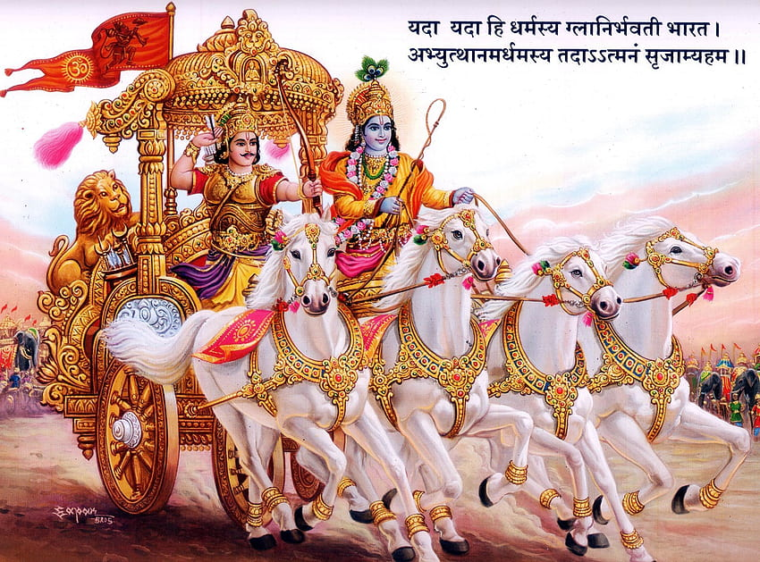

# web_page_gods

<html>
    <head>
        <title>Bhagavad Gita</title>
        
        
    </head>
    <body>
        

            

                

                    <h1 id="heading01">SHRI KRISHNA</h1>
                

                

                    <ul>
                        <li><a href="">BOOKS</a></li>
                        <li><a href="">NOVELS</a></li>
                        <li><a href="">HELP!</a></li>
                    </ul>
                

            

            <h1 id="heading02">BHAGAWAD GEETA</h1>
            

                

                    

                    

<h2>पहला अध्यायःअर्जुनविषादयोग</h2>भगवान श्रीकृष्ण ने अर्जुन को निमित्त बना कर समस्त विश्व को गीता के रूप में जो महान् उपदेश दिया है, यह अध्याय उसकी प्रस्तावना रूप है |<pre>            <a href="">More &#8594;</a></pre>

                

                

                    

                    

<h2>दूसरा अध्यायः सांख्ययोग- श्रीमद् भगवदगीता</h2>पहले अध्याय में गीता में कहे हुए उपदेश की प्रस्तावना रूप दोनों सेनाओं के महारथियों की तथा शंखध्वनिपूर्वक अर्जुन का रथ दोनों सेनाओं के बीच खड़ा रखने की बात कही गयी | बाद में दोनों सेनाओं में खड़े अपने कुटुम्बी और स्वजनों को देखकर, शोक और मोह के कारण अर्जुन युद्ध करने से रुक गया और अस्त्र-शस्त्र छोड़कर विषाद करने बैठ गया |<pre>     <a href="">MORE</a></pre>

                
 
                

                    

                    

<h2>तीसरा अध्यायः कर्मयोग</h2>दूसरे अध्याय में भगवान श्रीकृष्ण ने श्लोक 11 से श्लोक 30 तक आत्मतत्त्व समझाकर सांख्ययोग का प्रतिपादन किया | बाद में श्लोक 31 से श्लोक 53 तक समस्त बुद्धिरूप कर्मयोग के द्वारा परमेश्वर को पाये हुए स्थितप्रज्ञ सिद्ध पुरुष के लक्षण, आचरण और महत्व का प्रतिपादन किया | इसमें कर्मयोग की महिमा बताते हुए भगवान ने 47 तथा 48वें श्लोक में कर्मयोग का स्वरूप बताकर अर्जुन को कर्म करने को कहा | 49वें श्लोक में समत्व बुद्धिरूप कर्मयोग की अपेक्षा सकाम कर्म का स्थान बहुत नीचा बताया | 50वें श्लोक में समत्व बुद्धियुक्त पुरुष की प्रशंसा करके अर्जुन को कर्मयोग में जुड़ जाने के लिए कहा और 51 वे श्लोक में बताया कि समत्व बुद्धियुक्त ज्ञानी पुरुष को परम पद की प्राप्ति होती है | यह प्रसंग सुनकर अर्जुन ठीक से तय नहीं कर पाया | इसलिए भगवान से उसका और स्पष्टीकरण कराने तथा अपना निश्चित कल्याण जानने की इच्छा से अर्जुन पूछता हैः<pre>          <a href="">More &#8594;</a></pre>

                

                

                    

                    

<h2>चौथा अध्याय: ज्ञानकर्मसन्यासयोग</h2>तीसरे अध्याय के श्लोक 4 से 21 तक में भगवान ने कई प्रकार के नियत कर्मों के आचरण की आवश्यकता बतायी, फिर 30वें श्लोक में भक्ति प्रधान कर्मयोग की विधि से ममता, आसक्ति और कामनाओं का सर्वथा त्याग करके प्रभुप्रीत्यर्थ कर्म करने की आज्ञा दी |<pre>             <a href="">More &#8594;</a></pre>

                

                

                    

                    

<h2>पाँचवाँ अध्यायः कर्मसंन्यासयोग</h2>तीसरे और चौथे अध्याय में अर्जुन ने भगवान श्रीकृण्ण के मुख से कर्म की अनेक प्रकार से प्रशंसा सुनकर और उसके अनुसार बरतने की प्रेरणा और आज्ञा पाकर साथ-साथ में यह भी जाना कि कर्मयोग के द्वारा भगवत्स्वरूप का तत्त्वज्ञान अपने-आप ही हो जाता है | चौथे अध्याय के अंत में भी भगवान ने उन्हें कर्मयोग प्राप्त करने को आज्ञा दी है, परंतु बीच-बीच में ब्रह्माग्ना यज्ञं यज्ञेनैवोपजुह्णति। <pre>              <a href="">More &#8594;</a></pre>

                

            

        

        

        <footer>
            

                

                    <h3>Contact Us</h3>
                    <ul>
                        <li>e-book</li>
                        <li>novels</li>
                        <li>novels</li>
                    </ul>
                

                

                    <h3>For Promotion</h3>
                    <ul>
                        <li>ads</li>
                        <li>Adverting</li>
                        <li>Links!!</li>
                    </ul>
                

                 
                

                    
                    
                    
                
    
            

        </footer>
    </body>
</html>
 
